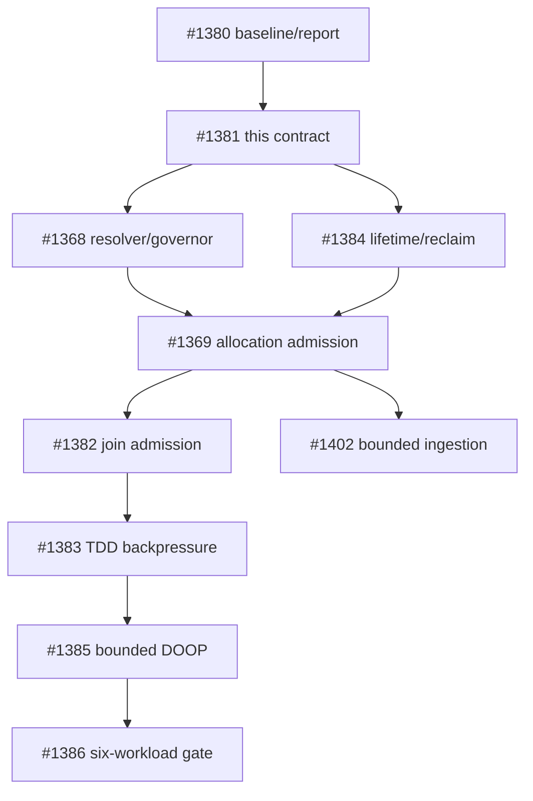

# Memory budget contract

This document defines the memory contract for a managed wirelog session. It
is normative for the resolver, governor, allocation sites, and TDD workers;
it does not turn the current accounting ledger into an allocator or an
admission controller.

## Scope and terminology

The contract covers memory reservations owned by one session: its coordinator,
workers, relation buffers, arenas, arrangements, caches, timestamps, exchange
buffers, and spill state. It does not promise a process-wide or host-wide OOM
guarantee. The following quantities remain distinct:

| Quantity | Meaning | Contract role |
| --- | --- | --- |
| Managed reservation | Bytes admitted to the session governor | Enforced budget |
| Ledger attribution | Best-effort current/peak counters by subsystem | Observability only |
| RSS/working set | Process residency, including allocator retention | Safety signal, not a reservation |
| cgroup/job/address-space limit | An external limit imposed by the host | Input to automatic resolution |
| Physical RAM | Installed or visible machine memory | Never a bounded guarantee by itself |

`wl_mem_ledger_t` currently implements attribution and reporting. Its
`budget == 0` compatibility value means “unlimited ledger accounting”; it
does not mean that a user supplied zero budget is accepted.

## Selecting a budget

There is one environment namespace: `WIRELOG_MEMORY_BUDGET`. The eventual
versioned session-options API has precedence over the environment, and the
environment has precedence over automatic resolution:

```text
versioned API option > WIRELOG_MEMORY_BUDGET > automatic resolution
```

The reusable `scripts/ci/run-memory-pressure.sh` helper records external-limit
evidence for a command: source and binary identity, command arguments,
effective ceiling, enforcement mechanism, exit/timeout classification, output
hashes, and Linux cgroup memory events when available. It prefers a writable
cgroup v2 and otherwise records a kernel-enforced `RLIMIT_AS` ceiling as a
different enforcement class. A bare `SIGKILL`/exit 137 is not treated as OOM;
resource-error mode requires supporting cgroup evidence. This runner is
qualification infrastructure only: its evidence does not prove that Wirelog
allocation classes, JOINs, TDD transport, or DOOP are bounded.

Values are decimal bytes (not MiB or a human-readable suffix). The following
table is part of the interface contract:

| Input | Result |
| --- | --- |
| API option absent and environment unset | Automatic resolution |
| Explicit positive value at least 256 MiB | Enforcing managed budget |
| Explicit zero | Invalid configuration; never silently becomes unlimited |
| Empty, signed, negative, non-decimal, or overflowed value | Invalid configuration |
| Positive value below 256 MiB | Invalid configuration |
| Explicit value on a supported platform | Enforcing managed budget |
| Automatic resolution with no supported limit source | Advisory/unbounded mode, with an explicit diagnostic; no bounded guarantee |

The minimum is a progress floor, not a promise that every workload fits. All
parsing and arithmetic must reject overflow before converting to `uint64_t`.
The internal zero value remains available only to represent an unlimited
ledger in tests and compatibility paths.

For the existing accounting hint, a threshold of `0` means pressure is true
for any valid nonzero subsystem cap, `100` means pressure starts at the cap,
and a value above `100` is invalid and returns false. This is not an admission
decision and does not reject an allocation.

Automatic resolution examines effective limits, not just the first file it can
read:

1. cgroup v2 `memory.max` and `memory.high`, including relevant ancestors;
2. cgroup v1 memory limits, including ancestors and unlimited sentinels;
3. `RLIMIT_AS` where supported, treating it as virtual address-space, not RSS;
4. supported Windows Job Object process-memory limits;
5. no physical-RAM-only fallback for an enforcing guarantee.

The internal `wl_session_create_with_options()` entry point accepts a
versioned, non-installed options object. Its `windows_job_handle` is a
borrowed opaque handle used only during synchronous creation; Wirelog stores
the resolved byte limit and provenance in the governor, and never duplicates
or closes the host handle. Missing, unsupported, or invalid handles clear the
provider and leave automatic resolution advisory unless another finite source
is available. `WIRELOG_MEMORY_BUDGET` remains higher precedence.
Options version 2 (#1473) adds `memory_governor`: a caller-retained governor
reference the session retains for its own lifetime in place of any resolved
source, so create-time admission can be driven deterministically from tests;
`windows_job_handle` and `WIRELOG_MEMORY_BUDGET` are ignored when it is set.
The program-owned intern table attached at creation keeps its own reference
until `wirelog_program_free()`, so the governor can outlive the session.

An unlimited cgroup value, an absent optional source, and an unsupported
platform are different observations. The resolver records which source was
selected and whether the result is enforcing or advisory. Tests use injected
provider fixtures for these cases; they must not depend on the host's actual
cgroup or RAM configuration.

## Reservation lifecycle

Every managed allocation follows this transaction:

```text
reserve(bytes) -> commit/transfer(owner) -> release(bytes)
       |                 |
       +-- rollback/cancel on failure
```

- `reserve` is an atomic admission operation against the shared session
  budget. It happens before the allocation can become visible to another
  operation.
- `commit` attaches the reservation to its owner. A transfer between the
  coordinator and a worker changes attribution, not the shared limit.
- `release` is idempotent for a committed reservation and returns capacity.
- Failed allocations roll back their reservation. Cancellation releases
  reservations and must not publish a partial result.
- A realloc that needs both old and new storage reserves the new size while
  the old size is still counted; only after a successful move may it release
  the old reservation.
- Overflow in a size, sum, or headroom calculation is a distinct
  representation-overflow failure, never a wrapped small reservation.
- A reserved cleanup/drain headroom remains available for rollback, error
  reporting, and worker teardown. It is not handed out as ordinary work
  capacity.

Coordinator and worker operations use one shared governor. A worker share is
only a fairness hint used for scheduling; `W` workers do not receive `W`
independent hard budgets. RSS sampling, allocator retention, and sampling
lag may trigger a safety brake, but they do not rewrite committed ownership.

## Failure and retry contract

These outcomes remain distinguishable internally and at the public boundary:

| Outcome | Meaning | Retry/reset rule |
| --- | --- | --- |
| Budget denial | Reservation would consume available managed capacity | Reclaim, reduce work, spill, or report a bounded-memory failure |
| Allocator failure | `malloc`/system allocation returned failure | Release reservation; report memory failure |
| Representation overflow | Size arithmetic cannot be represented | Release reservation; report invalid/overflow failure |
| I/O/spill failure | External backing store failed | Release or retain only durable committed state; report I/O failure |
| Cancellation | Host or operation cancellation | Roll back unpublished work and reservations |
| Unsupported configuration | Requested enforcement source/platform is unavailable | Explicit request fails; automatic mode may remain advisory as above |

On a successful retry after reclaim or a smaller request, the operation's
error state is reset and no partial rows are published. Retry loops are
bounded; the governor must not spin indefinitely while RSS or capacity is
unchanged. Public `create`, `insert`, `step`, and `snapshot` paths, including
typed and easy facades, must map these outcomes consistently when enforcement
is implemented.

## Ownership and sequencing

This issue defines the contract and boundary fixtures. Implementation is
owned as follows:

| Work | Owner | This contract supplies |
| --- | --- | --- |
| Budget source resolution, shared governor, advisory/enforcing state | #1368 | Precedence, providers, minimum, headroom, source provenance |
| Allocation-site admission and public propagation | #1369 | Reservation lifecycle, error taxonomy, retry/reset boundaries |
| Arrangement/cache lifetime and reclaim primitives | #1384 | Release/transfer behavior and cleanup reserve |
| Join admission, ingestion, TDD backpressure | #1382, #1402, #1383 | Workload-specific reservation sizes and rollback tests |
| Bounded DOOP and downstream gates | #1385–#1387 | Evidence that the contract works under constrained memory |

The existing ledger tests prove accounting invariants only: they do not prove
admission, allocator ownership, RSS control, or OOM prevention. In
particular, `wl_mem_ledger_alloc()` remains a post-allocation accounting call
and must not be used as a substitute for `reserve()`.



## Acceptance evidence

The contract unit is complete only when documentation and executable ledger
fixtures agree on:

- exact percentage arithmetic at `UINT64_MAX` scale;
- zero/unlimited internal ledger behavior and clamped remaining capacity;
- threshold `0`, `100`, and invalid values above `100`;
- saturating accounting rather than counter wraparound;
- deterministic subsystem percentages summing to 100;
- the boundary between accounting evidence and future admission evidence.

Resolver-provider, reservation-lifecycle, and session-lifecycle tests now cover
the #1368/#1413 foundation. Allocation-site admission tests belong to #1369;
the current ledger still does not claim to enforce individual allocations.

## Foundation implementation status

The internal wirelog/columnar/memory_governor.{h,c} foundation implements
the resolver and tokenized reservation primitive for #1368. Explicit
WIRELOG_MEMORY_BUDGET values are strict decimal bytes: empty, signed,
negative, non-decimal, overflowing, zero, and values below 256 MiB are
invalid. When the variable is unset, injected or runtime providers reduce
finite cgroup v1/v2 and RLIMIT_AS limits to the effective minimum; Windows
job limits have the same provider boundary. If no finite supported source is
available, resolution is advisory and unbounded.

An enforcing resolution reserves 5% cleanup headroom, capped at 256 MiB and
never above half the budget. Ordinary reservations can consume only the
remaining usable limit. Reservation tokens move through reserved, committed,
and released states; rollback is valid only from reserved, and release
returns capacity exactly once. Session lifetime/public error integration is
#1413. Allocation-site admission remains the responsibility of #1369, with
the public batch result collector as the scoped exception implemented by
#1418: the result object, relation table, names, row buffers, and type arrays
share one governor reservation. Growth uses replacement buffers and admits
the full new footprint while the old buffer is still live, so a failed growth
leaves the previous result unchanged. The result retains the governor until
`wirelog_result_free()`, which releases the reservation exactly once.

The #1413 integration adds a reference-counted coordinator-owned governor to
columnar sessions before relation, pool, arena, cache, or worker setup. Worker
sessions retain the same governor reference and release it during every
normal or partial teardown path. The fixed eval arenas now use
`wl_arena_create_managed()`: their complete backing capacity is admitted before
`malloc`, retained across reset, and released exactly once at destruction.
The fixed delta-pool slab and data arena follow the same lifecycle through
`delta_pool_create_managed()`. Coordinator, ordinary worker, and K-fusion
branch arenas and pools all use the same shared governor; legacy standalone
constructors remain unmanaged. Their ledgers remain attribution-only; while the legacy join
backpressure path still reads ledger thresholds, each worker gets an equal
reporting share so the aggregate threshold does not multiply by the worker
count. The removed `tdd_budget_per_party` value is no longer a second governor
admission domain.
Explicit invalid budgets fail session creation with the existing public
execution error mapping and leave output handles null. Parser AST, IR/program,
execution plan, executor wrapper, caller-owned fact buffers, CSV staging, and
advanced-API conversion buffers remain outside the result-only admission unit;
extending admission across parse → IR → optimize → plan requires a separate
lifetime and caller-owned context design.

The next #1369 allocation unit, #1425, admits only the `ht_head` and
`ht_next` backing arrays of primary, delta, and filtered hash arrangements.
Each arrangement retains the shared session governor while its registry entry
is alive. Full rebuilds and incremental capacity growth reserve the
prospective footprint before allocating replacement arrays; the old
reservation remains live until publication, and failed admission leaves the
old index unchanged. Sorted and differential arrangements, registry metadata,
relation/timestamp storage, cache policy, and join/TDD scratch remain separate
allocation classes.

## #1418 Allocation Coverage Matrix

The following matrix is the boundary for allocations created outside a
managed columnar session. “Covered” means that the owner retains a governor
reservation and publishes growth only after both admission and allocation
succeed. “Excluded” is an explicit non-guarantee; the owner must still
propagate failure and must not report a truncated successful result.

| Allocation class | Owner and lifetime | #1418 status | Failure contract |
| --- | --- | --- | --- |
| Parser AST and parse diagnostics | `wirelog_program_t`, released by `wirelog_program_free()` | Excluded; parse context is created before a managed session | Return `NULL` with `WIRELOG_ERR_PARSE` or `WIRELOG_ERR_MEMORY`; no partial program is published |
| Interned strings (`wl_intern_t`: hash slots, id segments, string copies) | `wirelog_program_t`; the reservation is retained until `wirelog_program_free()` | Covered from the first managed session (#1431): session creation attaches the program's table to that session's governor and admits the bytes it already holds transactionally, so session creation fails with `ENOMEM`/`EOVERFLOW` (public `WIRELOG_ERR_MEMORY`) when they exceed the budget; that governor owns the table for the program's lifetime regardless of later sessions' budgets, and session destruction never releases it. Each unique `wl_intern_put()` reserves the string copy plus any new id segment or doubled slot array before allocating, with the old footprint still held; duplicates are uncharged | `wl_intern_put()` returns `-1` and leaves every existing id, `wl_intern_reverse()` result and the reservation unchanged. Residual: string builtins and non-pre-interned literals evaluated under an enforcing budget carry that `-1` as a string id instead of failing the step (follow-up) |
| IR/program relation metadata | `wirelog_program_t`, released with the program | Excluded; same owner as parser output | Return `NULL` with the existing parse/IR error; callers retain no partially initialized program |
| Optimized execution plan | `wirelog_executor_t`, released by `wirelog_executor_free()` | Excluded; plan construction precedes result collection | Return `NULL` with `WIRELOG_ERR_INVALID_IR`, `WIRELOG_ERR_MEMORY`, or the existing executor error |
| Executor/session wrapper and columnar session storage | `wirelog_executor_t` and its session | Covered by #1413/#1369 session admission, not charged again here | Session creation fails with the existing public memory error and releases all reservations |
| Public result object, relation table, names, row buffers, and type arrays | `wirelog_result_t`, released by `wirelog_result_free()` | Covered by #1418 | Reserve the prospective footprint before replacement allocation; rollback leaves the old result unchanged and reports `WIRELOG_ERR_MEMORY` |
| Caller-owned fact buffers and input rows | Caller, released by the caller or input adapter | Excluded; ownership is external to wirelog | Reject the operation or return the existing input error; never charge or free caller storage |
| CSV staging and advanced-API conversion buffers | CSV/advanced API call, released at call completion | Excluded; temporary caller-facing buffers have independent ownership | Return `false` or the existing API error and discard the temporary buffer |

The matrix intentionally has one admission owner per allocation. The result
collector uses reservation move semantics when publishing a new token, so
the reservation identity follows `wirelog_result_t` rather than a temporary
stack object. The governor's denial, rollback, overflow, and exact-release
fixtures provide the admission primitive evidence; the Linux-only
`wirelog_result_oom` test uses linker allocation-failure injection over a
32-row result so relation-table and row-buffer growth cannot silently return
a truncated success. `wirelog_public_api` covers result lifetime after
executor destruction and the public error path. Other platforms retain the
same production transaction and ABI checks, while platform-specific allocator
failure injection remains outside this unit because GNU `--wrap` is not a
portable linker contract.
# wirelog Memory Instrumentation

This document describes what the columnar engine measures about its own
memory use, how to read the numbers, what they cost, and the baselines that
bounded-memory work (Issue #1367 and its sub-issues) starts from.  It covers
Issue #1380.

Nothing here enforces a limit.  The ledger is an accounting instrument; the
budget it carries (`WIRELOG_MEMORY_BUDGET`) only drives the join operator's
backpressure poll described in §6.

## 1. Units and conventions

- Every value is a byte count of an exact allocation size as requested from
  `malloc`/`calloc`/`realloc`, not a page count and not what the allocator
  actually reserved.
- The human-readable report uses binary prefixes: `1.0KB` is 1024 bytes,
  `1.0MB` is 1048576 bytes, `1.0GB` is 1073741824 bytes, printed with one
  decimal.
- Peak RSS (`rss_peak`) comes from `getrusage(RUSAGE_SELF).ru_maxrss`.  It
  is a process-wide, monotonically increasing kernel value: kilobytes on
  Linux (converted to bytes), bytes on macOS, unavailable on Windows
  (reported as 0).
- `current` is the value at the moment of the report; `peak` is the
  session-lifetime high-water mark of that counter.  Peaks are never reset
  by a second `wl_session_snapshot()`.

## 2. The ledger

Each `wl_col_session_t` embeds one `wl_mem_ledger_t`
(`wirelog/columnar/mem_ledger.h`).  It holds a total, a total peak and one
current/peak pair per subsystem, all updated with relaxed atomics so that
K-fusion branch threads and TDD workers can charge concurrently.  Two update
styles exist:

- **Event accounting** (`wl_mem_ledger_alloc`/`wl_mem_ledger_free`): the
  owner of an allocation charges when it allocates and credits when it
  frees.  Used where allocation and release are paired in code.
- **Gauge sampling** (`wl_mem_ledger_set_gauge`): the session re-measures a
  class it can enumerate and publishes the absolute value; the total moves
  by the difference.  Used where objects are mutated by many code paths
  without a single owner.

TDD worker sessions are separate `wl_col_session_t` values with their own
ledgers (budget = the per-party share, see §6).  Their peaks are folded into
the coordinator's aggregates when a worker is torn down, which happens after
every stratum that ran under TDD.

### 2.1 Subsystems

| Subsystem | Style | What is counted | Where |
|---|---|---|---|
| `RELATION` | event | Column buffers of operator output relations whose `col_rel_t.mem_ledger` is attached; today that is every join output (`col_join_attach_ledger`). Capacity-based (`capacity × owned columns × 8`). | `relation.c` growth, compaction and free paths |
| `ARENA` | event | Fixed capacity of the session's delta pool (slot slab + data arena) and eval arena, plus the compound arena object, generation table, payload buffers, and entry metadata. Each retained capacity is admitted before allocation with old/new peak overlap and released at destruction; the ledger remains attribution-only. `delta_pool_reset()`/`wl_arena_reset()` and compound epoch GC do not return retained capacity. K-fusion branch sessions charge their per-branch pool/arena to the parent. | `session.c`, `kfusion.c`, `arena.c`, `delta_pool.c`, `compound_arena.c` |
| `CACHE` | event | Materialization-cache entries. On insert the cached result is re-parented: its RELATION (and TIMESTAMP) charge is credited and the same bytes are charged to CACHE, so a cached join is counted once. Credited on eviction, truncation and clear. | `cache.c` |
| `ARRANGEMENT` | event | Hash arrangements (`ht_head` + `ht_next`), delta and filtered arrangements, sorted copies for LFTJ (`nrows × ncols × 8`, a full duplicate of the relation) and differential arrangements (struct + keys + buckets + chain). Worker clones are charged to the worker ledger. | `arrangement.c`, `diff_arrangement.c` |
| `TIMESTAMP` | event | `timestamps[]` arrays (24 bytes per row of capacity) of ledger-attached relations. Reconciled together with RELATION. | `relation.c` |
| `CHANNEL` | event | TDD delta transport: the MPSC ring storage for the stratum (charged at queue creation) plus every delta payload (columns + timestamps) between the worker's enqueue and the coordinator's drain or discard. Charged on the coordinator's ledger because ownership transfers on enqueue. | `eval.c`, `eval_tdd_queue.c` |
| `STORED` | gauge | Session-owned relations in `rels[]`: EDB and IDB relations on the coordinator, partitions on a worker. Column buffers plus timestamps; arena-owned columns count 0. | sampled, see §2.2 |
| `TEMPORARY` | gauge | Delta-pool temporaries whose column buffers spilled to the heap because the pool arena was full (`pool_owned && !arena_owned`), excluding those already attached to RELATION. | sampled, see §2.2 |

The per-subsystem cap printed in the report is `budget × share / 100` with
shares `50/10/10/10/5/5/5/5` in the order above.  Only the RELATION share
has an observable effect (§6); the others exist for the report.

### 2.2 Sampling points

`col_session_mem_sample()` re-measures STORED and TEMPORARY:

- on the sequential evaluator, immediately before every `delta_pool_reset()`
  (end of a non-recursive stratum, end of every recursive sub-pass, end of
  the recursive stratum), which is the high-water point of the temporaries;
- on a TDD worker, at the same point of its sub-pass;
- on the TDD coordinator, once per outer iteration;
- at the end of every `wl_session_snapshot()`, and once more in
  `col_session_destroy()` when a report is requested.

Cost is one pass over `nrels` plus the used pool slots, with no allocation.

### 2.3 What is not counted

The difference between `rss_peak` and the ledger peak is the unaccounted
remainder.  Known contributors, in roughly decreasing order for large
workloads:

- **Allocator overhead and fragmentation.** The ledger records requested
  sizes; glibc's arenas, per-thread caches and retained free chunks are
  invisible to it.  This is the largest term on DOOP-sized runs.
- **Delta-pool overflow structs.** When the slot slab is exhausted,
  temporaries fall back to `calloc`'d `col_rel_t` structs that are not
  enumerable from the pool and therefore not sampled into TEMPORARY.  Their
  column buffers are still counted if they are join outputs (RELATION).
- **K-fusion branch sessions.** A branch session is a struct copy of its
  parent, including a bitwise copy of the ledger that is discarded at
  teardown.  Branch arenas and pools are redirected to the parent (ARENA),
  but join outputs, arrangements and caches created inside a parallel
  branch (K ≥ 4) charge the throwaway copy.  #1375 retires this path.
- Parser and IR, the execution plan, nanoarrow schemas, the compound-term
  arena, exchange buffers, thread stacks (8 MB per TDD worker by default)
  and the work queue.  The intern table is program-owned but charged to
  the first managed session's governor (#1431, see the #1418 matrix); its
  bytes appear in that governor's reserved total, not in the session ledger.

## 3. Reading the report: `WL_MEM_REPORT`

`WL_MEM_REPORT` is read once at session creation.

| Value | Effect |
|---|---|
| unset, empty, `0` | No memory output. |
| `1` | At `col_session_destroy()` print the coordinator summary: one header line with `rss_peak`, the ledger table, and one aggregate line for TDD workers. |
| `2` | Additionally print the full ledger of every TDD worker when it is torn down (after every TDD stratum, so this is verbose). |

Example (`W=8`, the 100-edge closure fixture, level 2, one worker shown):

```
[wirelog mem] scope=coordinator workers=8 rss_peak=9.0MB
[wirelog mem] budget=94.3GB current=128.2MB peak=224.5MB
  RELATION     current=0B         peak=1.0MB      cap=47.2GB
  ARENA        current=128.1MB    peak=224.1MB    cap=9.4GB
  CACHE        current=0B         peak=0B         cap=9.4GB
  ARRANGEMENT  current=64.1KB     peak=64.1KB     cap=9.4GB
  TIMESTAMP    current=0B         peak=0B         cap=4.7GB
  CHANNEL      current=0B         peak=0B         cap=4.7GB
  STORED       current=100.6KB    peak=248.6KB    cap=4.7GB
  TEMPORARY    current=0B         peak=80.0KB     cap=4.7GB
[wirelog mem] tdd_workers reports=8 peak_max=12.5MB peak_sum=98.8MB
[wirelog mem] scope=worker id=0 workers=8
[wirelog mem] budget=10.5GB current=12.3MB peak=12.5MB
  RELATION     current=0B         peak=128.0KB    cap=5.2GB
  ARENA        current=12.0MB     peak=12.0MB     cap=1.0GB
  ...
```

`reports` is the number of worker teardowns folded in, `peak_max` the
largest single worker peak and `peak_sum` the sum of all worker peaks (an
upper bound on their concurrent footprint, since the same worker slot is
recreated per stratum).

The report is not async-signal-safe and goes to `stderr` unconditionally;
it does not use `WL_LOG`.

## 4. Programmatic access

`col_session_get_mem_stats()` (`wirelog/columnar/columnar_nanoarrow.h`,
internal) fills a `wl_columnar_mem_stats_t` with the same numbers: budget,
current, peak, per-subsystem current/peak indexed by `WL_MEM_SUBSYS_*`,
`rss_peak_bytes`, and the three worker aggregates.
`wl_columnar_mem_subsys_name()` maps an index to its name.  The accessor is
NULL-safe and never touches the atomics directly (it goes through
`wl_mem_ledger_snapshot()`).

`bench_flowlog --format json` emits the stats of the last run as
`ledger_peak_bytes`, `ledger_budget_bytes`, `ledger_worker_reports`,
`ledger_worker_peak_max_bytes`, `ledger_worker_peak_sum_bytes` and the
object `ledger_subsys_peak_bytes`, next to the existing `peak_rss_kb`.

## 5. Overhead

- **Event accounting:** one relaxed `fetch_add` (plus a peak CAS loop) per
  charge and one CAS loop per credit.  Charges happen on buffer growth, not
  per row: a relation that doubles its capacity is charged once per
  doubling.  The fast path of the join operator is unchanged.
- **Gauge sampling:** O(`nrels` + used pool slots) at each point in §2.2,
  typically a few hundred pointer reads per iteration.
- **Report:** a handful of `fprintf` calls at session teardown; nothing at
  all unless `WL_MEM_REPORT` is set.
- **Result identity:** instrumentation is always on; `WL_MEM_REPORT` only
  adds output.  `tests/test_mem_instrumentation.c` runs the fixture with the
  variable unset, `1` and `2` at W=1 and W=8 and requires identical tuple
  counts, iteration counts, relation contents and ledger peaks.

The instrumentation adds one pointer to `col_arrangement_t`,
`col_diff_arrangement_t`, `col_sorted_arr_t` and `col_mat_cache_t`, and one
`uint64_t` to `col_rel_t` and `col_mat_entry_t`.

## 6. Budget: `WIRELOG_MEMORY_BUDGET`

`WIRELOG_MEMORY_BUDGET=<bytes>` is the explicit managed-memory budget. An
unset value resolves the effective minimum of supported cgroup, address-space,
and host Job Object limits; when no finite source exists, the resolver is
advisory/unbounded. Explicit `0`, malformed values, overflow, and values below
256 MiB are invalid. This resolver does not use physical RAM as an enforcing
fallback. The legacy ledger worker-share hint remains separate from governor
admission; fixed eval-arena, delta-pool, and compound-arena backing storage
are now admitted. Joins and other allocation classes remain follow-up work.

The only consumer is the join operator: when RELATION reaches 80% of its
share (`wl_mem_ledger_should_backpressure(RELATION, 80)`), a worker session
stops generating rows for the current join and reports the condition
upstream.  The join row cap (`WIRELOG_JOIN_OUTPUT_LIMIT`, Issue #221) is a
separate mechanism.  Replacing both with admission control is #1367
(foundation in #1368).

## 7. Baselines

### 7.1 DOOP zxing (`bench_flowlog --workload doop`)

Dataset checksum `154593343fefd18306d4098ba9f6286947b134b56ebcf83d8e8eae368d5867e7`,
35 fact files, `--repeat 1`, release-like build, `WL_MEM_REPORT=1`, taken
on 2026-09-06 with the ledger coverage that existed at the time (RELATION
only; every other subsystem read 0).

| workers | duration | OS peak RSS | ledger peak (RELATION) | tuples | iterations | status |
|---:|---:|---:|---:|---:|---:|---|
| 1 | 2,335,563 ms (38 min 56 s) | 54,646,124 KB (52.1 GiB) | 32.0 GB | 13,828,835 | 153 | OK |
| 2 | 2,064,134 ms (34 min 24 s) | 56,718,660 KB (54.1 GiB) | 15.2 GB | 13,828,835 | 153 | OK |

The W=2 ledger peak is lower because half of the join outputs were charged
to worker ledgers, which were not aggregated at the time; OS RSS is higher
at W=2.  The 20 to 39 GiB gap between RSS and the ledger is the §2.3
remainder plus the classes that were not yet instrumented (stored
relations, arrangements, transport).  A rerun with the current coverage is
part of #1385; the nightly perf portfolio (§7.3) records the numbers per
run from now on.

### 7.2 Fixture: 100-edge chain closure (`tests/test_mem_instrumentation.c`)

`r(x,y) :- edge(x,y).  r(x,z) :- r(x,y), r(y,z).`, 5050 closure rows,
7 iterations, `WIRELOG_TDD_MIN_ROWS_PER_WORKER=1` for W=8 so the stratum
runs under TDD.  Printed by the test on every CI run as `mem-baseline`
lines; values in bytes, `current/peak`.

| build | W | ledger peak | rss_peak | worker peak_max (reports) | RELATION | ARENA | ARRANGEMENT | CHANNEL | STORED | TEMPORARY |
|---|---:|---:|---:|---:|---:|---:|---:|---:|---:|---:|
| fused | 1 | 135,721,092 | 5,545,984 | 0 (0) | 0/1,048,576 | 134,303,744/134,303,744 | 65,604/65,604 | 0/0 | 103,040/254,528 | 0/81,920 |
| fused | 8 | 134,961,176 | 5,750,784 | 13,055,492 (8) | 0/0 | 134,303,744/134,303,744 | 0/0 | 0/657,432 | 133,120/133,120 | 0/0 |
| nofusion | 1 | 135,721,092 | 5,701,632 | 0 (0) | 0/1,048,576 | 134,303,744/134,303,744 | 65,604/65,604 | 0/0 | 103,040/254,528 | 0/81,920 |
| nofusion | 8 | 134,961,176 | 8,491,008 | 13,055,300 (8) | 0/0 | 134,303,744/134,303,744 | 0/0 | 0/657,432 | 133,120/133,120 | 0/0 |

Reading the table: at W=1 the coordinator runs the joins itself (RELATION
and ARRANGEMENT non-zero); at W=8 they move to the workers (coordinator
RELATION/ARRANGEMENT 0, worker peak 12.5 MB each of which 12 MB is the
worker's own pool + arena), and the delta transport shows up as CHANNEL.
ARENA on the coordinator is the 64 MB pool arena + 256 slots + 64 MB eval
arena regardless of W.  `rss_peak` is below the ledger peak here because
the arenas are reserved but never touched at this size.

### 7.3 CI evidence

- `meson test` runs `mem_instrumentation_default` and
  `mem_instrumentation_nofusion` on every PR; their stdout carries the
  `mem-baseline` lines above for the current commit.
- `.github/workflows/perf-nightly.yml` runs `scripts/perf/run-flowlog-portfolio.py`,
  which now records `ledger_peak_bytes`, `ledger_worker_peak_max_bytes` and
  `ledger_subsys_peak_bytes` per (workload, workers) in `portfolio.jsonl`
  and the first two in `portfolio.tsv`, uploaded as the
  `perf-portfolio-<os>-<compiler>` artifact (35-day retention).

### 7.4 Reproducing

```
# Fixture baselines (both builds)
meson test -C build mem_instrumentation_default mem_instrumentation_nofusion -v

# Any bench_flowlog workload, JSON with ledger fields
./build/bench/bench_flowlog --workload tc --data bench/data/graph_100.csv \
    --workers 8 --repeat 1 --format json

# Human-readable report from any program
WL_MEM_REPORT=1 ./build/wirelog_cli --workers 8 program.dl
WL_MEM_REPORT=2 ./build/wirelog_cli --workers 8 program.dl   # + every worker

# DOOP (needs bench/data/doop, ~40 GB peak, tens of minutes)
WL_MEM_REPORT=1 ./build/bench/bench_flowlog --workload doop \
    --data-doop bench/data/doop --workers 1 --repeat 1 --format json
```

## 8. Compound-arena mutation window (#1423)

The coordinator owns compound-arena mutation and its governor reservations.
Workers acquire a non-copyable read lease before using a borrowed arena; the
lease remains active for the lifetime of any lookup pointer. Allocation,
retain, freeze/unfreeze, epoch GC, and destruction acquire the exclusive
mutation gate and therefore fail while a worker lease is active. The
coordinator must close all worker leases before destroying the arena.

Compound payload, entry-offset, and multiplicity growth is staged as one
transaction. A failure at any staging allocation frees only the new buffers,
rolls back pending reservations, and leaves the old pointers, counters and
governor charge unchanged. The unmanaged constructor remains independent of
the governor and the standalone fuzz target.

## 9. Related

- Issue #1380 (this instrumentation), #1385 (DOOP under a budget),
  #1367 / #1368 (memory governor and admission), #1375 (K-fusion
  retirement, which removes the branch-session gap in §2.3).
- `docs/THREADING.md` §5.1 audits every atomic in `mem_ledger.c`.
- `docs/STRESS_BASELINE.md` §Issue #598 for the rotation canary that
  asserts `current_bytes` is unchanged across `wl_arena_reset()`.

## 10. Primary arrangement leases (#1384)

Primary hash arrangements are session-owned cache entries. A join that probes
one through `col_session_pin_arrangement()` holds a non-public lease until the
probe has finished; the lease protects both the hash-table buffers and the
embedded entry identity from cache eviction. The flat entry registry is never
grown while a lease is active, so a caller that needs a new slot falls back to
an ephemeral arrangement. `col_arrangement_pin_release()` must be called
exactly once, including on allocation and join-error paths.

| Event | Pinned entry | Unpinned entry |
|---|---|---|
| LRU eviction | skip and defer reclamation | reclaim normally |
| relation invalidation | mark rebuild deferred; keep the old index readable | invalidate immediately |
| stale generation, row growth, or pending invalidation on lookup | defer rebuild and return unavailable; preserve hash buffers and chains | rebuild before returning |
| final lease release | apply deferred invalidation, without rebuilding; next lookup rebuilds lazily | no action |

This is an internal coordinator/worker-session contract, not a public API or a
general concurrent-reader mechanism. Release all leases before session teardown.
The lease protects index buffers and entry identity, not source column values,
row positions or compound storage: a reader must not probe an old index against
a mutated source. Source-reader protection is tracked in #1485; generation
checks on subsequent lookups are not a substitute for that protection.
Filtered, differential, sorted and
materialization-cache lifetimes, plus relation-generation validation, remain
tracked separately in issue #1435.
