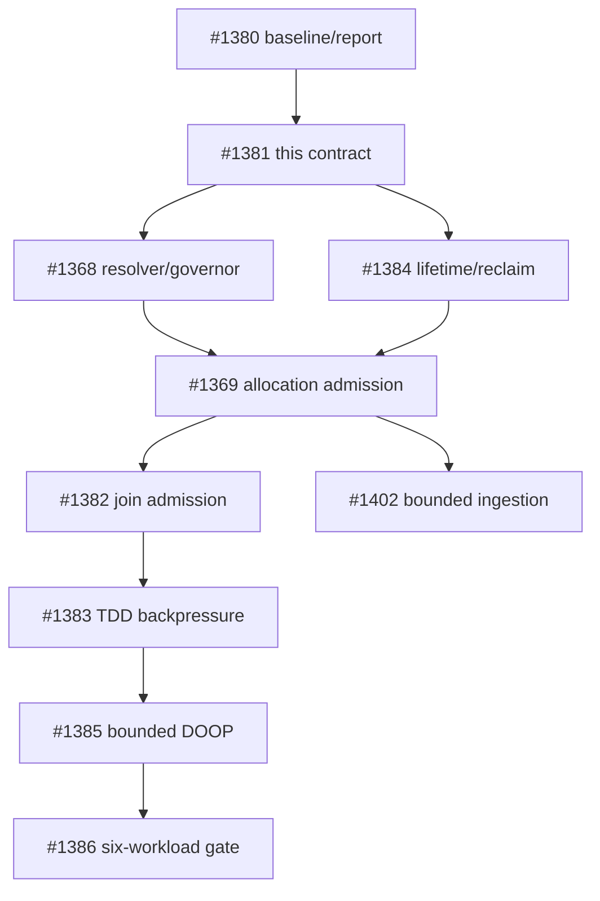

# Memory budget contract

This document defines the memory contract for a managed wirelog session. It
is normative for the resolver, governor, allocation sites, and TDD workers;
it does not turn the current accounting ledger into an allocator or an
admission controller.

## Scope and terminology

The contract covers memory reservations owned by one session: its coordinator,
workers, relation buffers, arenas, arrangements, caches, timestamps, exchange
buffers, and spill state. It does not promise a process-wide or host-wide OOM
guarantee. The following quantities remain distinct:

| Quantity | Meaning | Contract role |
| --- | --- | --- |
| Managed reservation | Bytes admitted to the session governor | Enforced budget |
| Ledger attribution | Best-effort current/peak counters by subsystem | Observability only |
| RSS/working set | Process residency, including allocator retention | Safety signal, not a reservation |
| cgroup/job/address-space limit | An external limit imposed by the host | Input to automatic resolution |
| Physical RAM | Installed or visible machine memory | Never a bounded guarantee by itself |

`wl_mem_ledger_t` currently implements attribution and reporting. Its
`budget == 0` compatibility value means “unlimited ledger accounting”; it
does not mean that a user supplied zero budget is accepted.

## Selecting a budget

There is one environment namespace: `WIRELOG_MEMORY_BUDGET`. The eventual
versioned session-options API has precedence over the environment, and the
environment has precedence over automatic resolution:

```text
versioned API option > WIRELOG_MEMORY_BUDGET > automatic resolution
```

The reusable `scripts/ci/run-memory-pressure.sh` helper records external-limit
evidence for a command: source and binary identity, command arguments,
effective ceiling, enforcement mechanism, exit/timeout classification, output
hashes, and Linux cgroup memory events when available. It prefers a writable
cgroup v2 and otherwise records a kernel-enforced `RLIMIT_AS` ceiling as a
different enforcement class. A bare `SIGKILL`/exit 137 is not treated as OOM;
resource-error mode requires supporting cgroup evidence. This runner is
qualification infrastructure only: its evidence does not prove that Wirelog
allocation classes, JOINs, TDD transport, or DOOP are bounded.

Values are decimal bytes (not MiB or a human-readable suffix). The following
table is part of the interface contract:

| Input | Result |
| --- | --- |
| API option absent and environment unset | Automatic resolution |
| Explicit positive value at least 256 MiB | Enforcing managed budget |
| Explicit zero | Invalid configuration; never silently becomes unlimited |
| Empty, signed, negative, non-decimal, or overflowed value | Invalid configuration |
| Positive value below 256 MiB | Invalid configuration |
| Explicit value on a supported platform | Enforcing managed budget |
| Automatic resolution with no supported limit source | Advisory/unbounded mode, with an explicit diagnostic; no bounded guarantee |

The minimum is a progress floor, not a promise that every workload fits. All
parsing and arithmetic must reject overflow before converting to `uint64_t`.
The internal zero value remains available only to represent an unlimited
ledger in tests and compatibility paths.

For the existing accounting hint, a threshold of `0` means pressure is true
for any valid nonzero subsystem cap, `100` means pressure starts at the cap,
and a value above `100` is invalid and returns false. This is not an admission
decision and does not reject an allocation.

Automatic resolution examines effective limits, not just the first file it can
read:

1. cgroup v2 `memory.max` and `memory.high`, including relevant ancestors;
2. cgroup v1 memory limits, including ancestors and unlimited sentinels;
3. `RLIMIT_AS` where supported, treating it as virtual address-space, not RSS;
4. supported Windows Job Object process-memory limits;
5. no physical-RAM-only fallback for an enforcing guarantee.

The internal `wl_session_create_with_options()` entry point accepts a
versioned, non-installed options object. Its `windows_job_handle` is a
borrowed opaque handle used only during synchronous creation; Wirelog stores
the resolved byte limit and provenance in the governor, and never duplicates
or closes the host handle. Missing, unsupported, or invalid handles clear the
provider and leave automatic resolution advisory unless another finite source
is available. `WIRELOG_MEMORY_BUDGET` remains higher precedence.
Options version 2 (#1473) adds `memory_governor`: a caller-retained governor
reference the session retains for its own lifetime in place of any resolved
source, so create-time admission can be driven deterministically from tests;
`windows_job_handle` and `WIRELOG_MEMORY_BUDGET` are ignored when it is set.
The program-owned intern table attached at creation keeps its own reference
until `wirelog_program_free()`, so the governor can outlive the session.

An unlimited cgroup value, an absent optional source, and an unsupported
platform are different observations. The resolver records which source was
selected and whether the result is enforcing or advisory. Tests use injected
provider fixtures for these cases; they must not depend on the host's actual
cgroup or RAM configuration.

## Reservation lifecycle

Every managed allocation follows this transaction:

```text
reserve(bytes) -> commit/transfer(owner) -> release(bytes)
       |                 |
       +-- rollback/cancel on failure
```

- `reserve` is an atomic admission operation against the shared session
  budget. It happens before the allocation can become visible to another
  operation.
- `commit` attaches the reservation to its owner. A transfer between the
  coordinator and a worker changes attribution, not the shared limit.
- `release` is idempotent for a committed reservation and returns capacity.
- Failed allocations roll back their reservation. Cancellation releases
  reservations and must not publish a partial result.
- A realloc that needs both old and new storage reserves the new size while
  the old size is still counted; only after a successful move may it release
  the old reservation.
- A governed replacement uses the same overlap accounting even when the new
  footprint is smaller:

  ```text
  committed(old) -> begin_replacement(new)
      -> commit_replacement(new) -> release
      -> rollback_replacement(old) when publication cannot complete
  ```

  `begin_replacement` is the downsize-only primitive: it admits the complete
  new footprint before replacement
  storage is allocated or published, so the governor accounts for old and
  new storage at the same time. Commit drops the old charge only after the
  new storage is published and the old storage has been freed; rollback drops
  only the temporary new charge. If the final accounting transition is
  rejected after publication, rollback retains the old reservation as a
  conservative upper bound rather than under-accounting the live storage.
  The reservation identity, owner attribution, and generation remain on the
  original token throughout the transition. Relation-level writer gates
  still serialize storage publication; this reservation lifecycle provides
  the memory admission and rollback guarantee.
- Batch compaction admits every governed replacement before preparing any
  member. If one overlap cannot fit, all reservations admitted for that batch
  are rolled back and no member is published; this is a finite no-progress
  result, not an unbounded retry.
- Overflow in a size, sum, or headroom calculation is a distinct
  representation-overflow failure, never a wrapped small reservation.
- A reserved cleanup/drain headroom remains available for rollback, error
  reporting, and worker teardown. It is not handed out as ordinary work
  capacity.

Coordinator and worker operations use one shared governor. A worker share is
only a fairness hint used for scheduling; `W` workers do not receive `W`
independent hard budgets. RSS sampling, allocator retention, and sampling
lag may trigger a safety brake, but they do not rewrite committed ownership.

## Failure and retry contract

These outcomes remain distinguishable internally and at the public boundary:

| Outcome | Meaning | Retry/reset rule |
| --- | --- | --- |
| Budget denial | Reservation would consume available managed capacity | Reclaim, reduce work, spill, or report a bounded-memory failure |
| Allocator failure | `malloc`/system allocation returned failure | Release reservation; report memory failure |
| Representation overflow | Size arithmetic cannot be represented | Release reservation; report invalid/overflow failure |
| I/O/spill failure | External backing store failed | Release or retain only durable committed state; report I/O failure |
| Cancellation | Host or operation cancellation | Roll back unpublished work and reservations |
| Unsupported configuration | Requested enforcement source/platform is unavailable | Explicit request fails; automatic mode may remain advisory as above |

On a successful retry after reclaim or a smaller request, the operation's
error state is reset and no partial rows are published. Retry loops are
bounded; the governor must not spin indefinitely while RSS or capacity is
unchanged. Public `create`, `insert`, `step`, and `snapshot` paths, including
typed and easy facades, must map these outcomes consistently when enforcement
is implemented.

## Ownership and sequencing

This issue defines the contract and boundary fixtures. Implementation is
owned as follows:

| Work | Owner | This contract supplies |
| --- | --- | --- |
| Budget source resolution, shared governor, advisory/enforcing state | #1368 | Precedence, providers, minimum, headroom, source provenance |
| Allocation-site admission and public propagation | #1369 | Reservation lifecycle, error taxonomy, retry/reset boundaries |
| Arrangement/cache lifetime and reclaim primitives | #1384 | Release/transfer behavior and cleanup reserve |
| Join admission, ingestion, TDD backpressure | #1382, #1402, #1383 | Workload-specific reservation sizes and rollback tests |
| Bounded DOOP and downstream gates | #1385–#1387 | Evidence that the contract works under constrained memory |

The existing ledger tests prove accounting invariants only: they do not prove
admission, allocator ownership, RSS control, or OOM prevention. In
particular, `wl_mem_ledger_alloc()` remains a post-allocation accounting call
and must not be used as a substitute for `reserve()`.



## Acceptance evidence

The contract unit is complete only when documentation and executable ledger
fixtures agree on:

- exact percentage arithmetic at `UINT64_MAX` scale;
- zero/unlimited internal ledger behavior and clamped remaining capacity;
- threshold `0`, `100`, and invalid values above `100`;
- saturating accounting rather than counter wraparound;
- deterministic subsystem percentages summing to 100;
- the boundary between accounting evidence and future admission evidence.

Resolver-provider, reservation-lifecycle, and session-lifecycle tests now cover
the #1368/#1413 foundation. Allocation-site admission tests belong to #1369;
the current ledger still does not claim to enforce individual allocations.

## Foundation implementation status

The internal wirelog/columnar/memory_governor.{h,c} foundation implements
the resolver and tokenized reservation primitive for #1368. Explicit
WIRELOG_MEMORY_BUDGET values are strict decimal bytes: empty, signed,
negative, non-decimal, overflowing, zero, and values below 256 MiB are
invalid. When the variable is unset, injected or runtime providers reduce
finite cgroup v1/v2 and RLIMIT_AS limits to the effective minimum; Windows
job limits have the same provider boundary. If no finite supported source is
available, resolution is advisory and unbounded.

An enforcing resolution reserves 5% cleanup headroom, capped at 256 MiB and
never above half the budget. Ordinary reservations can consume only the
remaining usable limit. Reservation tokens move through reserved, committed,
and released states; rollback is valid only from reserved, and release
returns capacity exactly once. Session lifetime/public error integration is
#1413. Allocation-site admission remains the responsibility of #1369, with
the public batch result collector as the scoped exception implemented by
#1418: the result object, relation table, names, row buffers, and type arrays
share one governor reservation. Growth uses replacement buffers and admits
the full new footprint while the old buffer is still live, so a failed growth
leaves the previous result unchanged. The result retains the governor until
`wirelog_result_free()`, which releases the reservation exactly once.

The #1413 integration adds a reference-counted coordinator-owned governor to
columnar sessions before relation, pool, arena, cache, or worker setup. Worker
sessions retain the same governor reference and release it during every
normal or partial teardown path. The fixed eval arenas now use
`wl_arena_create_managed()`: their complete backing capacity is admitted before
`malloc`, retained across reset, and released exactly once at destruction.
Recursive TDD subpasses retain popped results, lower stack entries and CONCAT
segment boundaries in persistent cleanup frames. Segment metadata is disposed
with its entry; a refused owned relation keeps its metadata and allocator
storage reachable. Specialized rule evaluators remain tracked by #1661.

Hybrid TDD initialization gives existing empty IDBs private governed worker
relations, preserving schema, graph/compound metadata and timestamp mode.
Only EDB/earlier-stratum inputs use shared views: borrowing empty IDB storage
would prevent the coordinator from publishing the first delta. Partial setup
reclaims every untransferred slot, including the current incomplete relation. The
partitioned, replicated and global-read initializers likewise inspect every
allocated worker row and original relation slot on failure. Non-NULL matrix
entries remain caller-owned; worker creation NULLs entries only on transfer.
Attempted-worker counts control checked teardown, never caller-slot cleanup.
A refused worker stays in the coordinator cohort until release and retry.

Final recursive aggregate canonicalization takes the canonical relation's source
writer and excludes live storage aliases before changing rows or timestamps.
Borrowed destinations refuse publication. Reader/alias refusal and group-map
allocation failure preserve the relation; access is released before arrangement
invalidation. TDD final relation normalization likewise uses an admitted private
candidate and checked publication after worker dependencies retire. Merge paths
consume worker results before teardown; finalization errors do not record
convergence or advance completed iteration history. Private exchange intermediates
and global-read exchange publication remain separate from this final boundary.
Specialized nonrecursive publication stages independent worker results before
retiring input views, then publishes one checked normalized replacement.

Heap and pooled constructors create independently owned Arrow schemas, including
untyped and zero-width relations. Clones preserve declared width, names, types,
graph metadata and required compound maps; a failed required map copy fails
construction instead of changing tuple interpretation. Arena-backed pooled
construction initializes schema without replacing arena columns. Partitions
preserve that metadata and scatter timestamps with their rows. Empty and
replicated worker inputs use governed clones; legacy partition buffer allocation
still follows its existing admission contract.

The fixed delta-pool slab and data arena follow the same lifecycle through
`delta_pool_create_managed()`. Coordinator, ordinary worker, and K-fusion
branch arenas and pools all use the same shared governor; legacy standalone
constructors remain unmanaged. Their ledgers remain attribution-only; while the legacy join
backpressure path still reads ledger thresholds, each worker gets an equal
reporting share so the aggregate threshold does not multiply by the worker
count. The removed `tdd_budget_per_party` value is no longer a second governor
admission domain.
Explicit invalid budgets fail session creation with the existing public
execution error mapping and leave output handles null. Parser AST, IR/program,
execution plan, executor wrapper, caller-owned fact buffers, CSV staging, and
advanced-API conversion buffers remain outside the result-only admission unit;
extending admission across parse → IR → optimize → plan requires a separate
lifetime and caller-owned context design.

The next #1369 allocation unit, #1425, admits only the `ht_head` and
`ht_next` backing arrays of primary, delta, and filtered hash arrangements.
Each arrangement retains the shared session governor while its registry entry
is alive. Full rebuilds and incremental capacity growth reserve the
prospective footprint before allocating replacement arrays; the old
reservation remains live until publication, and failed admission leaves the
old index unchanged. Sorted and differential arrangements, registry metadata,
relation/timestamp storage, cache policy, and join/TDD scratch remain separate
allocation classes.

## #1418 Allocation Coverage Matrix

The following matrix is the boundary for allocations created outside a
managed columnar session. “Covered” means that the owner retains a governor
reservation and publishes growth only after both admission and allocation
succeed. “Excluded” is an explicit non-guarantee; the owner must still
propagate failure and must not report a truncated successful result.

| Allocation class | Owner and lifetime | #1418 status | Failure contract |
| --- | --- | --- | --- |
| Parser AST and parse diagnostics | `wirelog_program_t`, released by `wirelog_program_free()` | Excluded; parse context is created before a managed session | Return `NULL` with `WIRELOG_ERR_PARSE` or `WIRELOG_ERR_MEMORY`; no partial program is published |
| Interned strings (`wl_intern_t`: hash slots, id segments, string copies) | `wirelog_program_t`; the reservation is retained until `wirelog_program_free()` | Covered from the first managed session (#1431): session creation attaches the program's table to that session's governor and admits the bytes it already holds transactionally, so session creation fails with `ENOMEM`/`EOVERFLOW` (public `WIRELOG_ERR_MEMORY`) when they exceed the budget; session destruction never releases it; while a live session, worker or result still holds that governor, later sessions get `EBUSY` and leave it in place, and once the table is the only holder the next session creation rebinds the table transactionally (#1469): the retained footprint is admitted under the new governor first and only then credited back to the orphaned one, so a denied rebind (`ENOMEM`/`EOVERFLOW`, session creation fails) leaves the old reservation and the new governor unchanged. Each unique `wl_intern_put()` reserves the string copy plus any new id segment or doubled slot array before allocating, with the old footprint still held; duplicates are uncharged | `wl_intern_put()` returns `-1` and leaves every existing id, `wl_intern_reverse()` result and the reservation unchanged. String builtins, `uuid5_rfc` and non-pre-interned literals whose result cannot be interned fail the evaluation step with `ENOMEM` and publish no row (#1470), which the easy, advanced and legacy facades report as `WIRELOG_ERR_MEMORY` without a scalar-extension diagnostic (#1521); invalid operands still yield `-1` as before |
| IR/program relation metadata | `wirelog_program_t`, released with the program | Excluded; same owner as parser output | Return `NULL` with the existing parse/IR error; callers retain no partially initialized program |
| Optimized execution plan | `wirelog_executor_t`, released by `wirelog_executor_free()` | Excluded; plan construction precedes result collection | Return `NULL` with `WIRELOG_ERR_INVALID_IR`, `WIRELOG_ERR_MEMORY`, or the existing executor error |
| Executor/session wrapper and columnar session storage | `wirelog_executor_t` and its session | Covered by #1413/#1369 session admission, not charged again here | Session creation fails with the existing public memory error and releases all reservations |
| Public result object, relation table, names, row buffers, and type arrays | `wirelog_result_t`, released by `wirelog_result_free()` | Covered by #1418 | Reserve the prospective footprint before replacement allocation; rollback leaves the old result unchanged and reports `WIRELOG_ERR_MEMORY` |
| Caller-owned fact buffers and input rows | Caller, released by the caller or input adapter | Excluded; ownership is external to wirelog | Reject the operation or return the existing input error; never charge or free caller storage |
| CSV staging and advanced-API conversion buffers | CSV/advanced API call, released at call completion | Excluded; temporary caller-facing buffers have independent ownership | Return `false` or the existing API error and discard the temporary buffer |

The matrix intentionally has one admission owner per allocation. The result
collector uses reservation move semantics when publishing a new token, so
the reservation identity follows `wirelog_result_t` rather than a temporary
stack object. The governor's denial, rollback, overflow, and exact-release
fixtures provide the admission primitive evidence; the Linux-only
`wirelog_result_oom` test uses linker allocation-failure injection over a
32-row result so relation-table and row-buffer growth cannot silently return
a truncated success. `wirelog_public_api` covers result lifetime after
executor destruction and the public error path. Other platforms retain the
same production transaction and ABI checks, while platform-specific allocator
failure injection remains outside this unit because GNU `--wrap` is not a
portable linker contract.
# wirelog Memory Instrumentation

This document describes what the columnar engine measures about its own
memory use, how to read the numbers, what they cost, and the baselines that
bounded-memory work (Issue #1367 and its sub-issues) starts from.  It covers
Issue #1380.

Nothing here enforces a limit.  The ledger is an accounting instrument; the
budget it carries (`WIRELOG_MEMORY_BUDGET`) only drives the join operator's
backpressure poll described in §6.

## 1. Units and conventions

- Every value is a byte count of an exact allocation size as requested from
  `malloc`/`calloc`/`realloc`, not a page count and not what the allocator
  actually reserved.
- The human-readable report uses binary prefixes: `1.0KB` is 1024 bytes,
  `1.0MB` is 1048576 bytes, `1.0GB` is 1073741824 bytes, printed with one
  decimal.
- Peak RSS (`rss_peak`) comes from `getrusage(RUSAGE_SELF).ru_maxrss`.  It
  is a process-wide, monotonically increasing kernel value: kilobytes on
  Linux (converted to bytes), bytes on macOS, unavailable on Windows
  (reported as 0).
- `current` is the value at the moment of the report; `peak` is the
  session-lifetime high-water mark of that counter.  Peaks are never reset
  by a second `wl_session_snapshot()`.

## 2. The ledger

Each `wl_col_session_t` embeds one `wl_mem_ledger_t`
(`wirelog/columnar/mem_ledger.h`).  It holds a total, a total peak and one
current/peak pair per subsystem, all updated with relaxed atomics so that
K-fusion branch threads and TDD workers can charge concurrently.  Two update
styles exist:

- **Event accounting** (`wl_mem_ledger_alloc`/`wl_mem_ledger_free`): the
  owner of an allocation charges when it allocates and credits when it
  frees.  Used where allocation and release are paired in code.
- **Gauge sampling** (`wl_mem_ledger_set_gauge`): the session re-measures a
  class it can enumerate and publishes the absolute value; the total moves
  by the difference.  Used where objects are mutated by many code paths
  without a single owner.

TDD worker sessions are separate `wl_col_session_t` values with their own
ledgers (budget = the per-party share, see §6).  Their peaks are folded into
the coordinator's aggregates when a worker is torn down, which happens after
every stratum that ran under TDD.

### 2.1 Subsystems

| Subsystem | Style | What is counted | Where |
|---|---|---|---|
| `RELATION` | event | Column buffers of operator output relations whose `col_rel_t.mem_ledger` is attached; today that is every join output (`col_join_attach_ledger`). Capacity-based (`capacity × owned columns × 8`). A **heap-owned** join output additionally holds a governor reservation for its live capacity (§10b); pooled outputs remain ledger-only. | `relation.c` growth, compaction and free paths |
| `ARENA` | event | Fixed capacity of the session's delta pool (slot slab + data arena) and eval arena, plus the compound arena object, generation table, payload buffers, and entry metadata. Each retained capacity is admitted before allocation with old/new peak overlap and released at destruction; the ledger remains attribution-only. `delta_pool_reset()`/`wl_arena_reset()` and compound epoch GC do not return retained capacity. K-fusion branch sessions charge their per-branch pool/arena to the parent. | `session.c`, `kfusion.c`, `arena.c`, `delta_pool.c`, `compound_arena.c` |
| `CACHE` | event | Materialization-cache entries. On insert the cached result is re-parented: its RELATION (and TIMESTAMP) charge is credited and the same bytes are charged to CACHE, so a cached join is counted once. Credited on eviction, truncation and clear. | `cache.c` |
| `ARRANGEMENT` | event | Hash arrangements (`ht_head` + `ht_next`), delta and filtered arrangements, sorted copies for LFTJ (`nrows × ncols × 8`, a full duplicate of the relation) and differential arrangements (struct + keys + buckets + chain). Worker clones are charged to the worker ledger. | `arrangement.c`, `diff_arrangement.c` |
| `TIMESTAMP` | event | `timestamps[]` arrays (24 bytes per row of capacity) of ledger-attached relations. Reconciled together with RELATION. | `relation.c` |
| `CHANNEL` | event | TDD delta transport: the MPSC ring storage for the stratum (charged at queue creation) plus every delta payload (columns + timestamps) between the worker's enqueue and the coordinator's drain or discard. Charged on the coordinator's ledger because ownership transfers on enqueue. | `eval.c`, `eval_tdd_queue.c` |
| `STORED` | gauge | Session-owned relations in `rels[]`: EDB and IDB relations on the coordinator, partitions on a worker. Column buffers plus timestamps; arena-owned columns count 0. | sampled, see §2.2 |
| `TEMPORARY` | gauge | Delta-pool temporaries whose column buffers spilled to the heap because the pool arena was full (`pool_owned && !arena_owned`), excluding those already attached to RELATION, plus admitted evaluator cleanup frames and retained delta-step rollback records. | sampled, see §2.2 |

The per-subsystem cap printed in the report is `budget × share / 100` with
shares `50/10/10/10/5/5/5/5` in the order above.  Only the RELATION share
has an observable effect (§6); the others exist for the report.

### 2.2 Sampling points

`col_session_mem_sample()` re-measures STORED and TEMPORARY:

- on the sequential evaluator, immediately before every `delta_pool_reset()`
  (end of a non-recursive stratum, end of every recursive sub-pass, end of
  the recursive stratum), which is the high-water point of the temporaries;
- on a TDD worker, at the same point of its sub-pass;
- on the TDD coordinator, once per outer iteration;
- at the end of every `wl_session_snapshot()`, and once more in
  `col_session_destroy()` when a report is requested.

Cost is one pass over `nrels` plus the used pool slots, with no allocation.

### 2.3 What is not counted

The difference between `rss_peak` and the ledger peak is the unaccounted
remainder.  Known contributors, in roughly decreasing order for large
workloads:

- **Allocator overhead and fragmentation.** The ledger records requested
  sizes; glibc's arenas, per-thread caches and retained free chunks are
  invisible to it.  This is the largest term on DOOP-sized runs.
- **Delta-pool overflow structs.** When the slot slab is exhausted,
  temporaries fall back to `calloc`'d `col_rel_t` structs that are not
  enumerable from the pool and therefore not sampled into TEMPORARY.  Their
  column buffers are still counted if they are join outputs (RELATION).
- **K-fusion branch sessions.** A branch session is a struct copy of its
  parent, including a bitwise copy of the ledger that is discarded at
  teardown.  Branch arenas and pools are redirected to the parent (ARENA),
  but join outputs, arrangements and caches created inside a parallel
  branch (K ≥ 4) charge the throwaway copy.  #1375 retires this path.
- Parser and IR, the execution plan, nanoarrow schemas, the compound-term
  arena, exchange buffers, thread stacks (8 MB per TDD worker by default)
  and the work queue.  The intern table is program-owned but charged to
  the first managed session's governor (#1431, see the #1418 matrix); its
  bytes appear in that governor's reserved total, not in the session ledger.
  Once no live session, worker or result holds that governor, the next
  session creation rebinds the table to its own governor (#1469).

## 3. Reading the report: `WL_MEM_REPORT`

`WL_MEM_REPORT` is read once at session creation.

| Value | Effect |
|---|---|
| unset, empty, `0` | No memory output. |
| `1` | At `col_session_destroy()` print the coordinator summary: one header line with `rss_peak`, the ledger table, and one aggregate line for TDD workers. |
| `2` | Additionally print the full ledger of every TDD worker when it is torn down (after every TDD stratum, so this is verbose). |

Example (`W=8`, the 100-edge closure fixture, level 2, one worker shown):

```
[wirelog mem] scope=coordinator workers=8 rss_peak=9.0MB
[wirelog mem] budget=94.3GB current=128.2MB peak=224.5MB
  RELATION     current=0B         peak=1.0MB      cap=47.2GB
  ARENA        current=128.1MB    peak=224.1MB    cap=9.4GB
  CACHE        current=0B         peak=0B         cap=9.4GB
  ARRANGEMENT  current=64.1KB     peak=64.1KB     cap=9.4GB
  TIMESTAMP    current=0B         peak=0B         cap=4.7GB
  CHANNEL      current=0B         peak=0B         cap=4.7GB
  STORED       current=100.6KB    peak=248.6KB    cap=4.7GB
  TEMPORARY    current=0B         peak=80.0KB     cap=4.7GB
[wirelog mem] tdd_workers reports=8 peak_max=12.5MB peak_sum=98.8MB
[wirelog mem] scope=worker id=0 workers=8
[wirelog mem] budget=10.5GB current=12.3MB peak=12.5MB
  RELATION     current=0B         peak=128.0KB    cap=5.2GB
  ARENA        current=12.0MB     peak=12.0MB     cap=1.0GB
  ...
```

`reports` is the number of worker teardowns folded in, `peak_max` the
largest single worker peak and `peak_sum` the sum of all worker peaks (an
upper bound on their concurrent footprint, since the same worker slot is
recreated per stratum).

The report is not async-signal-safe and goes to `stderr` unconditionally;
it does not use `WL_LOG`.

## 4. Programmatic access

`col_session_get_mem_stats()` (`wirelog/columnar/columnar_nanoarrow.h`,
internal) fills a `wl_columnar_mem_stats_t` with the same numbers: budget,
current, peak, per-subsystem current/peak indexed by `WL_MEM_SUBSYS_*`,
`rss_peak_bytes`, and the three worker aggregates.
`wl_columnar_mem_subsys_name()` maps an index to its name.  The accessor is
NULL-safe and never touches the atomics directly (it goes through
`wl_mem_ledger_snapshot()`).

`bench_flowlog --format json` emits the stats of the last run as
`ledger_peak_bytes`, `ledger_budget_bytes`, `ledger_worker_reports`,
`ledger_worker_peak_max_bytes`, `ledger_worker_peak_sum_bytes` and the
object `ledger_subsys_peak_bytes`, next to the existing `peak_rss_kb`.

## 5. Overhead

- **Event accounting:** one relaxed `fetch_add` (plus a peak CAS loop) per
  charge and one CAS loop per credit.  Charges happen on buffer growth, not
  per row: a relation that doubles its capacity is charged once per
  doubling.  The fast path of the join operator is unchanged.
- **Gauge sampling:** O(`nrels` + used pool slots) at each point in §2.2,
  typically a few hundred pointer reads per iteration.
- **Report:** a handful of `fprintf` calls at session teardown; nothing at
  all unless `WL_MEM_REPORT` is set.
- **Result identity:** instrumentation is always on; `WL_MEM_REPORT` only
  adds output.  `tests/test_mem_instrumentation.c` runs the fixture with the
  variable unset, `1` and `2` at W=1 and W=8 and requires identical tuple
  counts, iteration counts, relation contents and ledger peaks.

The instrumentation adds one pointer to `col_arrangement_t`,
`col_diff_arrangement_t`, `col_sorted_arr_t` and `col_mat_cache_t`, and one
`uint64_t` to `col_rel_t` and `col_mat_entry_t`.

## 6. Budget: `WIRELOG_MEMORY_BUDGET`

`WIRELOG_MEMORY_BUDGET=<bytes>` is the explicit managed-memory budget. An
unset value resolves the effective minimum of supported cgroup, address-space,
and host Job Object limits; when no finite source exists, the resolver is
advisory/unbounded. Explicit `0`, malformed values, overflow, and values below
256 MiB are invalid. This resolver does not use physical RAM as an enforcing
fallback. The legacy ledger worker-share hint remains separate from governor
admission; fixed eval-arena, delta-pool, and compound-arena backing storage
are now admitted. Joins and other allocation classes remain follow-up work.

The only consumer is the join operator: when RELATION reaches 80% of its
share (`wl_mem_ledger_should_backpressure(RELATION, 80)`), a worker session
stops generating rows for the current join and reports the condition
upstream.  The join row cap (`WIRELOG_JOIN_OUTPUT_LIMIT`, Issue #221) is a
separate mechanism.  Replacing both with admission control is #1367
(foundation in #1368).

## 7. Baselines

### 7.1 DOOP zxing (`bench_flowlog --workload doop`)

Dataset checksum `154593343fefd18306d4098ba9f6286947b134b56ebcf83d8e8eae368d5867e7`,
35 fact files, `--repeat 1`, release-like build, `WL_MEM_REPORT=1`, taken
on 2026-09-06 with the ledger coverage that existed at the time (RELATION
only; every other subsystem read 0).

| workers | duration | OS peak RSS | ledger peak (RELATION) | tuples | iterations | status |
|---:|---:|---:|---:|---:|---:|---|
| 1 | 2,335,563 ms (38 min 56 s) | 54,646,124 KB (52.1 GiB) | 32.0 GB | 13,828,835 | 153 | OK |
| 2 | 2,064,134 ms (34 min 24 s) | 56,718,660 KB (54.1 GiB) | 15.2 GB | 13,828,835 | 153 | OK |

The W=2 ledger peak is lower because half of the join outputs were charged
to worker ledgers, which were not aggregated at the time; OS RSS is higher
at W=2.  The 20 to 39 GiB gap between RSS and the ledger is the §2.3
remainder plus the classes that were not yet instrumented (stored
relations, arrangements, transport).  A rerun with the current coverage is
part of #1385; the nightly perf portfolio (§7.3) records the numbers per
run from now on.

### 7.2 Fixture: 100-edge chain closure (`tests/test_mem_instrumentation.c`)

`r(x,y) :- edge(x,y).  r(x,z) :- r(x,y), r(y,z).`, 5050 closure rows,
7 iterations, `WIRELOG_TDD_MIN_ROWS_PER_WORKER=1` for W=8 so the stratum
runs under TDD.  Printed by the test on every CI run as `mem-baseline`
lines; values in bytes, `current/peak`.

| build | W | ledger peak | rss_peak | worker peak_max (reports) | RELATION | ARENA | ARRANGEMENT | CHANNEL | STORED | TEMPORARY |
|---|---:|---:|---:|---:|---:|---:|---:|---:|---:|---:|
| fused | 1 | 135,721,092 | 5,545,984 | 0 (0) | 0/1,048,576 | 134,303,744/134,303,744 | 65,604/65,604 | 0/0 | 103,040/254,528 | 0/81,920 |
| fused | 8 | 134,961,176 | 5,750,784 | 13,055,492 (8) | 0/0 | 134,303,744/134,303,744 | 0/0 | 0/657,432 | 133,120/133,120 | 0/0 |
| nofusion | 1 | 135,721,092 | 5,701,632 | 0 (0) | 0/1,048,576 | 134,303,744/134,303,744 | 65,604/65,604 | 0/0 | 103,040/254,528 | 0/81,920 |
| nofusion | 8 | 134,961,176 | 8,491,008 | 13,055,300 (8) | 0/0 | 134,303,744/134,303,744 | 0/0 | 0/657,432 | 133,120/133,120 | 0/0 |

Reading the table: at W=1 the coordinator runs the joins itself (RELATION
and ARRANGEMENT non-zero); at W=8 they move to the workers (coordinator
RELATION/ARRANGEMENT 0, worker peak 12.5 MB each of which 12 MB is the
worker's own pool + arena), and the delta transport shows up as CHANNEL.
ARENA on the coordinator is the 64 MB pool arena + 256 slots + 64 MB eval
arena regardless of W.  `rss_peak` is below the ledger peak here because
the arenas are reserved but never touched at this size.

### 7.3 CI evidence

- `meson test` runs `mem_instrumentation_default` and
  `mem_instrumentation_nofusion` on every PR; their stdout carries the
  `mem-baseline` lines above for the current commit.
- `.github/workflows/perf-nightly.yml` runs `scripts/perf/run-flowlog-portfolio.py`,
  which now records `ledger_peak_bytes`, `ledger_worker_peak_max_bytes` and
  `ledger_subsys_peak_bytes` per (workload, workers) in `portfolio.jsonl`
  and the first two in `portfolio.tsv`, uploaded as the
  `perf-portfolio-<os>-<compiler>` artifact (35-day retention).

### 7.4 Reproducing

```
# Fixture baselines (both builds)
meson test -C build mem_instrumentation_default mem_instrumentation_nofusion -v

# Any bench_flowlog workload, JSON with ledger fields
./build/bench/bench_flowlog --workload tc --data bench/data/graph_100.csv \
    --workers 8 --repeat 1 --format json

# Human-readable report from any program
WL_MEM_REPORT=1 ./build/wirelog_cli --workers 8 program.dl
WL_MEM_REPORT=2 ./build/wirelog_cli --workers 8 program.dl   # + every worker

# DOOP (needs bench/data/doop, ~40 GB peak, tens of minutes)
WL_MEM_REPORT=1 ./build/bench/bench_flowlog --workload doop \
    --data-doop bench/data/doop --workers 1 --repeat 1 --format json
```

## 8. Compound-arena mutation window (#1423)

The coordinator owns compound-arena mutation and its governor reservations.
Workers acquire a non-copyable read lease before using a borrowed arena; the
lease remains active for the lifetime of any lookup pointer. Allocation,
retain, freeze/unfreeze, epoch GC, and destruction acquire the exclusive
mutation gate and therefore fail while a worker lease is active. The
coordinator must close all worker leases before destroying the arena.

Compound payload, entry-offset, and multiplicity growth is staged as one
transaction. A failure at any staging allocation frees only the new buffers,
rolls back pending reservations, and leaves the old pointers, counters and
governor charge unchanged. The unmanaged constructor remains independent of
the governor and the standalone fuzz target.

## 9. Related

- Issue #1380 (this instrumentation), #1385 (DOOP under a budget),
  #1367 / #1368 (memory governor and admission), #1375 (K-fusion
  retirement, which removes the branch-session gap in §2.3).
- `docs/THREADING.md` §5.1 audits every atomic in `mem_ledger.c`.
- `docs/STRESS_BASELINE.md` §Issue #598 for the rotation canary that
  asserts `current_bytes` is unchanged across `wl_arena_reset()`.

## 10. Primary arrangement leases (#1384)

### Integrated ownership and reader boundaries

The following matrix describes the implemented ownership mechanisms. A cache
pin protects its entry; a source reader protects the relation version that an
operator actually reads. Neither is implied merely by putting a pointer on
the evaluation stack. Paths below are relative to `wirelog/columnar/`.

| Resource | Owner and reader protection | Release / invalidation boundary | Implementation |
|---|---|---|---|
| Session relation columns, schema and timestamps | Session owns the relation; source readers bind its descriptor and ultimate storage owner | Checked mutation/destruction requires writer access; identity, view and storage generations invalidate dependent views | `relation.c`, `session.c` |
| Worker relation views and compound arena | Worker owns private descriptors/arrangements and borrows coordinator storage through source/arena leases | Drain tasks and release aliases/read leases before coordinator storage is destroyed | `session.c`, `../arena/compound_arena.c` |
| Owned evaluation-stack result and segment boundaries | Stack entry owns destruction of its relation and its segment array | `eval_entry_dispose` destroys the relation before freeing segment metadata; a refused disposal retains the entry | `eval_stack.c` |
| Borrowed evaluation-stack result | Relation remains owned by its session, cache or enclosing operation; the entry does not acquire a general-purpose pin | Owner must outlive every consuming operator; disposing the entry does not destroy the borrowed relation | `eval_stack.c`, `eval_plan.c` |
| Primary hash arrangement | Session cache owns buckets/chains; probe bundle holds index pin and source readers | Eviction skips pins; invalidation defers; final release permits lazy rebuild | `arrangement.c`, `join.c` |
| Sorted arrangement | Session owns sorted copy; LFTJ probe pins entry and source | Release probe before teardown; source changes require rebuild, deferred while pinned | `arrangement.c`, `lftj.c` |
| Differential arrangement | Session owns persistent index; transaction owns unpublished replacement; pin binds source snapshot | Replacement/invalidation cannot overwrite a leased index; abort discards staged work; final release applies deferred reset | `diff_arrangement.c`, `diff_join_batch.c` |
| Filtered-relation cache | Cache owns filtered relation; explicit cache pins defer replacement | Last pin release destroys an invalidated entry; immediate-release lookup wrapper does not retain a pin for its caller | `filter.c` |
| Materialization cache | Cache exclusively owns accepted heap results; lookup pin protects copying | JOIN exposes an independent copy to the stack; eviction/clear waits for pins and destroys the cached result once | `cache.c`, `join.c` |
| Delta transport payload | Producer transfers owned relation to queue, then coordinator matrix/consumer | Reconstruction deduplicates malformed aliases; discard destroys each owned queued payload; current matrix retains one payload per worker/relation, not an arbitrary batch stream | `eval_tdd_queue.c`, `eval.c` |
| Continuation scratch and published batches | Producer owns scratch and input/index leases; synchronous sink owns committed output | Cursor advances at publication commit; destroy releases producer state; no asynchronous lifetime is implied for scratch-backed payloads | `continuation.c`, `join_batch.c`, `diff_join_batch.c` |
| Delta-step rollback snapshots | Session owns admitted metadata, copied names and flat rows; stable relation identities prevent restoration into replacement registrations; a GC-only compound hold preserves handle IDs | Capture completes before detachment; checked restoration retains refused backups; successful evaluation or recovery releases them once; teardown discards pending backups after evaluator cleanup | `eval_delta.c`, `relation.c`, `session.c` |

Delta-step rollback preserves the existing empty-descriptor restoration policy:
only a relation actually detached by the step, still registered with the same
identity, and still without columns is restored. Populated partial evaluation
results and replacement registrations are preserved. This is not a transaction
that rolls back the entire stratum. Storage rollback alone does not recover
notifications for partial results; whole-step observer ownership below provides
that guarantee for public incremental steps. Failed steps publish no callbacks.

Whole-step notification ownership is separate from per-stratum storage rollback.
An observer transaction captures admitted, owned logical output names and flat
row sets before any affected stratum runs. Duplicate output names are captured
once, including absent or empty outputs. A compound GC hold protects handles
through retry and callback delivery. Relation replacement does not invalidate
this baseline; changed arity yields old removals and new additions with their
respective row widths.

Evaluation failures retain the original observer baseline and affected mask.
After evaluation succeeds, the transaction remembers that phase, so compaction
or event-staging failure retries completion without rerunning evaluation. Final
sets are sorted and deduplicated with the same comparator before constructing
net signed events. All fallible preparation precedes delivery. Metadata, baseline
payload and staging have stable governor reservations; temporary accounting
includes all retained observer bytes. Buffers are freed before reservations are
released, and worker clones do not inherit observer ownership.

Pending transactions refuse nonzero input mutation, compound construction and
snapshot; step is the retry route. Callback publication also refuses reentrant
step. Each event reads the current callback/data pair, so replacement receives
the remaining suffix. NULL cancels the transaction's remaining notifications
without freeing active storage. Cancellation stays effective even if observation
is re-enabled, and retains evaluation phase until completion or teardown. This
preserves reconstruction on retry with a NULL callback. Successful completion
releases the observer hold before replaying coalesced frontier GC; failure and
teardown do not replay GC. Callback-triggered destruction remains unsupported.

One active or pending rollback record is permitted per session. Metadata and flat
payloads are admitted before allocation, and the governor reference and compound
hold remain owned until all snapshots are released. Capture failure changes no
live IDB. Detachment processes aliases before their owners; a later reader refusal
may leave a detached prefix, which is restored or retained for retry. Readiness
first drains evaluator frames, then attempts a finite restoration sweep. Repeated
reader or allocation refusal preserves unresolved backups and blocks mutation.
Quiescent cache reclamation is suppressed while this ownership remains pending.
Synchronous teardown rejects active work and discards pending backups after
frame cleanup without allocating restoration columns. Frontier GC requests made
through the rotation strategy while a record is active are coalesced. Successful
evaluation releases the backups and hold, then explicitly dispatches one requested
frontier collection before observer publication. Failed recovery and teardown do
not replay GC, and generic hold release still performs no collection. Independent
holds or a frozen arena can still defer that explicit collection attempt.

An iteration or frontier boundary alone does not authorize reclamation. All
queued tasks, consumer-held values, active probes and rollback obligations
must be accounted for first. The resident floor includes pinned inputs,
required indexes, rollback state and the scratch needed to make progress.
Admission may fail when that floor and the next required allocation cannot
fit; it must not retry indefinitely without released capacity. This is a
contract for admitted allocations, not a claim that all allocation classes,
spill access or downstream pipelines are already bounded (#1369, #1372,
#1475).

Every `col_eval_stratum` caller, including worker sessions, coordinator fallback,
recursive snapshot and delta steps, admits a persistent cleanup frame before
executing each relation plan. Ordinary direct recursive TDD subpasses use the
same framed relation helper. Outbound subpasses have a separate framed publisher.
The frame owns its stack,
popped result and segment metadata until publication or checked disposal.
Refusal preserves allocators, caches and registry owners until session readiness
can drain the frame; snapshot errors return before delta cleanup in this state.
Checked result renaming preserves the original name while a reader is active.
For an owned result appended to an existing target, a governed private heap
copy remains frame-owned while the original result is disposed. Target
publication follows successful disposal, so refusal cannot append duplicate
rows on initial snapshot retry. This requires an additional full temporary
copy; admission denial leaves the target unchanged.

Recursive rule-frame refusal preserves registered delta owners and caches.
Successful previous-pass publication empties all private delta slots before
rule evaluation; the error path asserts this invariant and releases only local
bookkeeping. Recursive delta-step refusal drains retained frames before storage
rollback restores detached relations. The whole-step observer keeps the original
notification baseline throughout both recovery stages.

Delta IDB consolidation also owns a persistent frame. It reads the registered
source into a governed private relation and prepares a checked replacement.
The temporary must be disposed before publication; refusal discards replacement
staging and releases the destination writer while the frame retains its owner.
Recovery drains that frame before storage rollback. Zero/one-row inputs validate
float values and return without mutating sort metadata.

Timestamped private candidates use typed set normalization that moves complete
provenance records with their rows. Equal tuples retain the earliest original
row's timestamp, including its signed multiplicity; this is set normalization,
not weighted aggregation. The original-index scratch is admitted and included
in active cleanup temporary accounting, then released before publication or
unwind. This path requires a private candidate and a replacement copy, increasing
peak admitted memory. Generic sorting timestamp correspondence remains #1689.

Normal FILTER output preserves the complete timestamp record for every selected
source row, including signed multiplicity and empty timestamp-enabled results.
Untimestamped output retains the legacy representation.

Right-side FILTER paths preserve the complete timestamp record for each selected
row in both pool-owned and cached filtered relations, and cached relations
retain the same correspondence across rebuilds and leases (#1720). Deterministic
allocation-failure and admission-retry coverage remains tracked separately in
#1729; normal FILTER provenance is #1715 and shared sort/deduplication is #1689.

The specialized parallel evaluator remains separate. An unsafe parallel plan
(such as CONCAT) returns EAGAIN before dispatch and then uses the framed serial
fallback. A late overflow fallback follows checked worker cleanup; cleanup
refusal must retain its error rather than trigger serial evaluation.

TDD correctness-check replay follows the same error boundary: failed serial
replay skips result restoration and releases only its independent saved copies.
Pending frames keep registered partial replay state and allocator storage alive
until snapshot retry drains them; no callbacks or arena reset precede recovery.

At quiescent snapshot failure and cache-reclaim boundaries, the coordinator
checks both its own cleanup owners and the retained TDD worker cohort. A pending
worker frame therefore prevents coordinator delta removal, registry compaction
and cache-pin release/reclamation. Worker lists are inspected only after the
dispatch barrier; checked teardown retains refused workers for readiness retry.
Callback-free public steps exercise nonrecursive TDD dispatch and error-time
cache reclamation. Snapshot selection currently excludes nonrecursive TDD; its
post-evaluation cohort guard also protects ordinary recursive TDD frames.
Public compound construction also checks quiescent cleanup readiness before
creating a side relation or allocating a handle, preserving pending input state
when coordinator or worker cleanup refuses.

Generic `col_eval_stratum_multiworker` arrays remain caller-owned. Their caller
must join, release readers and perform checked destruction; a full nonrecursive
retry recreates workers rather than rerunning partially published worker state.
They are not implicitly included in the coordinator's retained TDD cohort.

Prior registered TDD deltas remain immutable throughout worker dispatch. After
all workers join successfully and have no retained cleanup, the coordinator
prepares admitted, independent empty replacements before exchange. It retires
aliases across the cohort before roots, using checked registration replacement.
Empty registrations preserve later-round outbound AUTO semantics. Preparation
failure changes no registration; publication is atomic per registration, so a
successful prefix remains owned while a refused owner and its lease stay intact.
Exchange aborts on refusal and releases only newly produced queue/matrix deltas.
Recursive TDD workers check local cleanup readiness before changing
iteration state or worker flags. Their retained frames keep prior-round delta
dependencies alive. Ordinary subpasses produce fresh deltas after all rules
finish; outbound subpasses may publish independent deltas after each rule.
A refused frame therefore stops exchange and retains the cohort for public retry.

Outbound frames own a governed independent delta candidate and dispose the
original result and lower entries before publication. Diff/dedup preparation
keeps the candidate private. Publication reuses checked timestamp storage and
holds its source writer through provenance stamping and queue/slot transfer,
refusing live readers or aliases. Transfer clears the frame's pointer before
releasing the writer; consumers wait for the worker barrier. Failure retains
the candidate for checked disposal. Earlier queued payloads remain independent
and are reclaimed after the barrier if a later rule fails.

Global-read exchange prepares admitted empty replacements for every worker view
of a changed IDB, then retires those views with checked registration replacement
before publishing coordinator rows. External readers still refuse publication;
a retired prefix remains independently owned. Combined deltas preserve schema,
compound metadata and timestamps and use checked normalization. First publication
into a schema-less target adopts complete metadata through checked replacement.
Worker views refresh only after publication; zero-progress targets and empty
next-delta registrations retain their existing semantics. An exchange failure
reclaims every untransferred fresh matrix payload before checked cohort cleanup.
Publication is atomic per target, not per exchange: a successful prefix can
remain, and public snapshot retry completes the exact set after dependencies
release without emitting callbacks for the failed attempt.

Specialized nonrecursive workers evaluate in persistent worker-owned cleanup
frames. A coordinator frame admits a fixed slot for each worker before dispatch;
workers copy into separate governed slots and finish their original results,
lower entries and segment metadata on their own threads. The coordinator reads
those slots only after the dispatch barrier, clears transient join-counter
pointers and retires worker views through checked teardown. A refused worker
frame retains its allocator and dependencies for public retry.

A governed final candidate combines existing output and worker rows, preserving
append behavior without CONSOLIDATE and performing checked private normalization
when requested. Existing outputs use prepared replacement: all staging cleanup
must succeed before commit, and replacement reservations are always discarded.
Missing outputs transfer the private candidate only when the registry owns it.
Reader, admission or allocation failure leaves an existing target unchanged.
This costs independent staging and replacement storage, admitted before use; it
is an atomic relation publication, not a transaction across a whole stratum.
Specialized slices and staging preserve incoming timestamp records. FILTER's
pre-existing loss of selected-row provenance is tracked separately by #1715,
and generic sorting/consolidation provenance remains #1689.

K-Fusion refusal handling (#1648) and the remaining #1661 integration audit
still precede closing #1384. Pool/arena relations cannot use the heap-only
deferred registry, and a live reader prevents promoting their descriptors.
Internal checked cleanup can return `EBUSY`; public session destruction remains
synchronous and does not offer recoverable deferred destruction. See
`wirelog/session.c` and `session.c` for that distinction.

Primary hash arrangements are session-owned cache entries. A join that probes
one through `col_session_pin_arrangement()` holds a non-public lease until the
probe has finished; the lease protects both the hash-table buffers and the
embedded entry identity from cache eviction. The flat entry registry is never
grown while a lease is active, so lookup may report the arrangement unavailable.
The caller decides whether that status permits an ephemeral fallback or must
be propagated as an error. `col_arrangement_pin_release()` must be called
exactly once, including on allocation and join-error paths.

| Event | Pinned entry | Unpinned entry |
|---|---|---|
| LRU eviction | skip and defer reclamation | reclaim and clear the token |
| relation invalidation | mark rebuild deferred; keep the old index readable | clear the token immediately |
| stale or cleared token, row growth, or pending invalidation on lookup | defer rebuild and return unavailable; preserve hash buffers and chains | rebuild before returning |
| final lease release | apply deferred invalidation by clearing the token, without rebuilding; next lookup rebuilds lazily | no action |

An index is unbuilt exactly when its buffers are freed or its source token is
invalid; invalidation, deferred release and eviction clear the token (#1500).
An empty relation's index is built (16 buckets, no chain array) and is not
stale: it is handed out as is, leased or not, and a second lease on it
succeeds.

This is an internal coordinator/worker-session contract, not a public API or a
general concurrent-reader mechanism. Release all leases before session teardown.
Primary probes, compound/side-relation dependencies, and differential working
arrangements are acquired as one operation-scoped transactional bundle. The
bound source reader and ultimate storage-owner generation protect source
columns, row positions, aliases, metadata, and compound storage for that
operation. Mutation is denied with `EBUSY` while the bundle is live and may be
retried after release; aborted differential work leaves the persistent index
and accounting unchanged.

Checked internal teardown drains queued work and rejects destruction while a
live source lease remains. Filtered, materialization, differential and sorted
cache ownership is described below; those mechanisms do not remove the
cleanup-refusal limitations in the matrix's accompanying contract.

## 11. Sorted-arrangement leases for LFTJ

Sorted row-major copies used by leapfrog triejoin are session-owned storage,
not borrowed scratch buffers. `col_session_acquire_sorted_arrangement_probe`
acquires a source reader and pins the cache entry before LFTJ receives the
`sorted` pointer. The lease remains active until the join, its callbacks, and
stack publication have finished. LFTJ tracks cache-backed inputs explicitly;
cleanup never re-queries the cache to decide whether an input may be freed.

While a sorted lease is active, source writers are blocked, the entry's sorted
buffer cannot be rebuilt or freed, and growth that would relocate the sorted
registry is rejected. A freshness change observed against a pinned entry is
recorded as deferred invalidation. The old buffer and its ledger charge stay
valid until the final lease is released; the next acquisition then rebuilds it
lazily. Every success and error path must release the lease before session or
worker teardown.

### Filtered-relation cache leases (#1435)

The filtered-relation cache (`filt_cache`, #386) carries the same lease shape.
`wl_columnar_filter_apply_right_filter_cached_pin()` returns the cached
filtered relation under a lease released exactly once by
`col_filt_cache_pin_release()`; the unleased lookup is a wrapper that takes and
immediately releases a lease, so with no other lease active its behaviour is
unchanged, and with one active it can report the cache unavailable exactly as
the leased lookup does. Leases hold entry pointers, so while any lease is
active the entry array is neither grown nor compacted: a miss that would need
growth reports the cache unavailable, and an invalidation empties unpinned
entries for the relation in place instead of compacting. The counter is
asserted zero at session and worker teardown (an `assert`, active unless the
build disables assertions).

| Event | Pinned entry | Unpinned entry |
|---|---|---|
| lookup with a stale token | mark deferred; keep the old relation readable; report unavailable | rebuild in place |
| relation invalidation (`session_add_rel`) | mark deferred; keep the old relation readable | destroy (emptied in place while any lease is active) |
| cache growth on a miss | refused while any lease is active | grow |
| final lease release | destroy the deferred relation; next lookup rebuilds | no action |

A keyed join whose cache lookup returns NULL uses an owned filtered relation
for that operation. Production JOIN currently calls the immediate-release
wrapper, not the explicit cache-pin interface. Its source-reader bundle is a
separate mechanism and must not be described as a retained filtered-cache pin.
Owned filtered fallbacks bypass the non-delta filtered-arrangement and
materialization caches; their operation-local descriptors cannot become cache
keys or retained cache dependencies.

The filtered-cache lease is likewise an internal coordinator/worker-session
contract, not a public API or a general concurrent-reader mechanism.
Relation-generation validation and the other cache-specific lifetime
mechanisms are integrated, as described in the ownership matrix and adjacent
sections. This does not establish a universal pin for borrowed stack values.

### Materialization-cache ownership

The materialization cache accepts only a result whose storage is exclusively
heap-owned by that result: pool-owned, arena-owned, shared-view, and aliased
relations are rejected before cache or ledger state changes. This is required
because eviction, clear, and reclaimer paths destroy accepted results. A
rejected result remains the producer's responsibility and may be destroyed or
reused by the caller. An accepted result transfers its relation charge to the
cache ledger and is destroyed exactly once when its final unpinned entry is
removed.

### Differential-arrangement leases

Differential hash arrangements use a separate registry-entry lease because
their row links refer to relation positions and are replaced transactionally.
`col_session_pin_diff_arrangement()` acquires a source-reader lease and records
the entry generation and source snapshot; `col_diff_arrangement_pin_release()`
releases both exactly once. While a lease is active, source invalidation is
deferred, registry growth that would relocate entries is refused, and
differential transaction replacement returns `EBUSY`. The final release
applies the deferred reset and advances the entry generation. A continuation
must treat a generation or snapshot mismatch as stale and release the lease
before session teardown. Session teardown also rejects any still-active
differential pin or replacement transaction before destroying relations.

## 10a. Bounded join sub-batches (#1446)

`WIRELOG_JOIN_BATCH_BYTES=N` (strict decimal, default unset = off) makes an
eligible keyed join run the resumable sub-batch producer in
`wirelog/columnar/join_batch.c` instead of the one-shot probe loop.
Eligible means: `key_count > 0`, a persistent primary arrangement on the
right relation, no right-side delta, no right filter expression, and a
coordinator or single session (TDD workers are excluded, so the shared
row counter never applies).  Every other shape falls back to the one-shot
join; the session records the fallback count and last reason and logs one
`JOIN` warning per reason.  `WIRELOG_JOIN_BATCH_STRICT=1` (ignored unless
the bytes knob is set) turns a fallback into an `ENOTSUP` failure, which is
the explicit bounded-mode result for unsupported shapes.  Differential
keyed joins have the separate producer described below; pipeline consumption
of batches on the eval stack (JOIN -> FILTER* -> MAP) remains #1475.

Ownership and admission:

- The producer holds one arrangement lease for its whole lifetime and
  one governed scratch relation of `rows_per_batch = N / row_bytes` rows
  (at least the 64 rows a fresh relation pre-allocates), admitted once at
  create; `N` smaller than one output row, or a zero-width output, is a
  recorded fallback (`row-too-large`).
- The output relation is heap allocated (never from the delta pool, whose
  reset frees nothing) and attached to the session governor.  Its retained
  token owns every visible output byte: the sink admits the capacity the
  relation already owns at attach, grows it to exactly the rows the next
  batch needs (`col_rel_reserve_capacity_admitted`, no doubling), and holds
  no token of its own.  Exact fit therefore means the governor admits the
  retained footprint formula of `relation.c` for the new capacity while the
  old buffers are still live.
- A batch becomes visible only when the sink commits it; the cursor
  advances only after commit.  A sink failure before commit rewinds
  `nrows` and retries the same batch without a new reservation; the
  capacity admitted for it is retained, as after a failed bulk append.
  Any mutation of either input or a rebuild of the arrangement between
  batches is reported as stale rather than resumed.
- Per-producer bound: scratch (`rows_per_batch * row_bytes` plus the key
  row) plus the sink's growth increment for the next batch, transiently
  up to twice `rows_per_batch * row_bytes` during the exact-fit resize.
  The full join result is still materialized into the output relation:
  this unit bounds producer memory and admits output growth, it does not
  bound the output itself.
- The legacy row cap `WIRELOG_JOIN_OUTPUT_LIMIT` stays distinct and is
  checked once per committed batch, so it may be overshot by at most
  `rows_per_batch - 1` rows in bounded mode.  The ledger backpressure
  heuristic of the one-shot loop is not consulted per row in bounded mode;
  admission is the bound.

Differential keyed joins use `wirelog/columnar/diff_join_batch.c` when bounded
mode is enabled for a normal keyed join.  The right relation is incrementally
indexed in a differential transaction before the continuation starts; that
cache transaction is committed before a differential generation/source pin is
held for the continuation.  Each batch preserves the signed timestamp
multiplicity product (`left * right`).  Stale input, generation changes,
overflow, cancellation, or failed admission discard the output relation and
release the differential pin exactly once.  Materialized/cache joins and
delta-right, filtered, cross, worker, and other unsupported shapes remain on
their existing one-shot paths until their publication contracts are bounded.

## 10b. Governed join output capacity (#1477)

A join output that is **heap-owned** is admitted under the session governor
and holds a reservation covering its live capacity.  A **pool-owned** output
is not: `delta_pool_reset()` rewinds counters without freeing slot contents,
so a governor reference on a pooled relation would leak.  The discriminator
is `col_rel_t.pool_owned`, not `wl_plan_op_t.materialized` -- bounded mode
forces a heap output with `materialized == false`, and a materialized join
*with a projection* is pool allocated.

The ordering invariant, which `tests/test_memory_admission_join.c` asserts at
every observation point as
`col_rel_retained_bytes_for(r, r->capacity) == r->retained_reserved_bytes`:

> No relation reachable from `join.c` whose `memory_governor` is non-NULL
> ever has its `capacity` increased without a reservation covering the new
> footprint committed first, and the previous token is released only after
> the old buffers are freed.

Both growth shapes obey it.  Row append goes through
`col_rel_reserve_capacity_admitted()` one doubling at a time.  Bulk sizing
through `col_join_reserve_exact()` routes governed relations to the same
helper, which is what admits the parallel cross-join output -- that path
allocates its own relation, sizes it to `left->nrows * right->nrows` and
substitutes it for the caller's, so without admission the largest single
allocation in `join.c` would reach the materialization cache ungoverned.
Ungoverned callers keep the plain `realloc()` path, which is what leaves the
pool-owned semijoin output unchanged.

In `col_join_reserve_exact()` the governed branch runs **before** the
`nrows <= capacity` early return, and must stay there.  `col_rel_new_auto()`
allocates `COL_REL_INIT_CAP` rows up front, so a cross product that fits
inside the initial capacity performs no growth at all; with the branch below
the early return, a relation attached to the governor by
`col_join_parallel_cross()` would hold live buffers against a zero token.

The population is wider than "materialized".  A **bounded-mode** output is
also heap-owned, and when its batch producer cannot be created the operator
falls back to the serial loop without ever reaching
`col_join_batch_relation_sink_init()`.  That output was heap-owned and
ungoverned before this unit and is admitted now, so a finite budget can deny
a bounded-fallback join that previously succeeded.

Denial surfaces as `ENOMEM` and never truncates a result, and it is never
retried against a still-full governor.  Two paths matter, and they differ:

- In the **nonrecursive parallel** path, the only retry conversion is
  `EOVERFLOW` to `EAGAIN` after a round that published nothing, which the
  serial caller turns into exactly one serial re-evaluation.  `ENOMEM`
  passes through unchanged and aborts the stratum.
- In the **TDD delta** path, `EOVERFLOW` and `ENOMEM` are both hard errors
  requiring coordinator intervention; neither is retried.

Either way a denial is a non-zero status with nothing published, so it
cannot be mistaken for the empty-result backpressure path that would cause
premature fixed-point convergence.

Accounting notes, so two numbers that legitimately differ are not read as a
bug:

- `col_mat_cache` re-parents the **ledger** on insert (RELATION to CACHE) and
  leaves the governor token with the relation, so a cached join output is
  charged once on each axis.  The token is released when the entry is
  evicted, cleared or destroyed.
- `cache->total_bytes` is **nrows**-based while a governor token is
  **capacity**-based and includes timestamps, so the governor charge can run
  up to about 2x the cache's own accounting.
- `COL_MAT_CACHE_LIMIT_BYTES` is not a hard ceiling: a single oversized
  result is admitted once eviction has emptied the cache, so the bound is
  "limit plus one oversized entry".
- A **pinned** cache entry defers its release at `col_mat_cache_clear()`
  until the final pin is dropped.  The mechanism is pre-existing and
  unchanged, but the consequence is new: the deferral now holds governor
  bytes, not only ledger bytes.  Note also that `col_mat_cache_lookup()`
  itself takes an epoch pin despite its header describing the result as an
  unpinned borrowed pointer, so a diagnostic lookup before a clear defers
  that entry.
- The parallel cross-join path holds **two charged** footprints transiently
  -- the caller's placeholder plus the substitute's own token -- and briefly
  **three physical** ones, because the substitute's initial
  `COL_REL_INIT_CAP` buffers are resident and uncharged between
  `col_rel_new_auto()` and the bulk reserve's publish.  The substitute is
  attached without an admission and enters its bulk reserve with a zero
  token, so no retired token is produced.  That uncharged window is
  single-threaded inside `col_join_parallel_cross()` and always closes,
  since the bulk reserve admits `max(nrows, capacity)`.  A cross join
  therefore needs roughly `COL_REL_INIT_CAP x ocols x 8` of headroom beyond
  its result, and `wl_columnar_memory_reserved()` sampled after the join
  reports the residual, not that peak.

**Residual R1 (accepted, tracked separately).** On the materialized path the
operator deep-copies its output for the evaluation stack with a NULL governor
and hands the governed original to the cache.  Both buffers are live and
physically identical, so the governor charges once for twice the resident
bytes.  Governing the copy would place a governed relation on the evaluation
stack, whose consumers have their own ownership contracts; that is the
eval-stack admission class and is out of scope here.

**Untested by construction.** The `col_join_reserve_exact()` caller inside
`wl_columnar_join_diff_op` is not driven end to end by
`tests/test_memory_admission_join.c`; the parallel cross path covers the same
branch. Reaching the diff-op caller requires all of: a heap-owned right
relation registered under `op->right_relation`; `key_count > 0`; no right
filter expression; `!used_right_delta`; `left->nrows >= num_workers *
WIRELOG_JOIN_PAR_MIN_LEFT_ROWS`; and more than `COL_REL_INIT_CAP` output
rows, since a smaller result makes the bulk reserve a no-op.

`WL_MEM_REPORT` total reconciliation is asserted only narrowly here: the
cache-clear case proves that clearing releases exactly the output's token.
A full report-level reconciliation for join outputs is not covered.

## 10c. Plain STEP completion recovery (#1713)

When a nonrecursive TDD plain `STEP` has merged worker results but checked
relation finalization or compaction returns `EBUSY`, the coordinator retains a
bounded scalar completion cursor. A later public `STEP` or `SNAPSHOT` resumes
that cursor before evaluating or emitting anything else; completed worker
publication is not replayed. Relation and alias readers therefore keep their
rows, generations, provenance, and reservations unchanged across refusal.
Input and compound mutations remain refused while completion is pending. The
continuation is limited to post-merge nonrecursive completion; arbitrary
mid-operator or partial-merge rollback is outside this contract.
